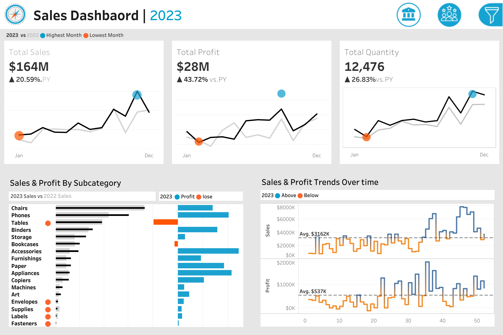
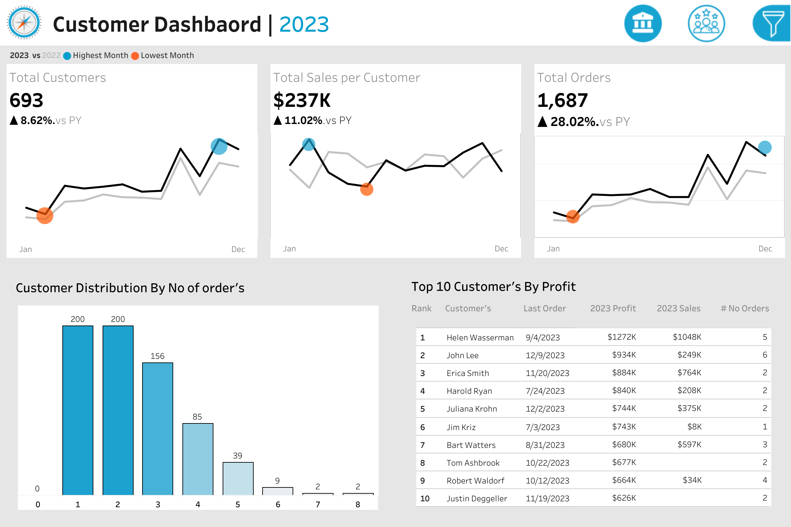

# 📊 Sales & Customer Analytics Dashboard | Tableau

An interactive **Tableau Business Intelligence Dashboard** designed to analyze **Sales Performance** and **Customer Behavior** through dynamic KPIs, year-over-year comparisons, and actionable business insights.

This project demonstrates end-to-end dashboard development using **Tableau**, including KPI reporting, calculated fields, parameters, table calculations, and interactive business intelligence visualizations.

---

# 🚀 Project Overview

Business stakeholders need a centralized dashboard to monitor sales performance, profitability, customer behavior, and purchasing trends.

This project transforms raw transactional data into interactive dashboards that enable better business decisions through meaningful visualizations and performance monitoring.

---

# 🎯 Business Objectives

- Monitor Year-over-Year Sales Performance
- Compare Current Year vs Previous Year KPIs
- Analyze Monthly Sales Trends
- Identify Highest & Lowest Performing Months
- Compare Product Subcategory Performance
- Track Weekly Sales & Profit Trends
- Analyze Customer Distribution by Number of Orders
- Identify Top 10 Customers by Profit
- Monitor Customer Sales Performance
- Enable interactive business analysis using filters and dashboard actions

---

# 🛠 Tools & Technologies

- Tableau Desktop
- Calculated Fields
- Parameters
- Table Calculations
- Dashboard Actions
- Interactive Filters
- CSV Data Sources
- Business Intelligence
- Data Visualization

---

# 📊 Dashboard Preview

## Sales Dashboard



---

## Customer Dashboard



---

# ⚡ Dashboard Features

## 📈 Sales Dashboard

- Executive KPI Cards
- Total Sales
- Total Profit
- Total Quantity
- Year-over-Year KPI Comparison
- Monthly Sales Trend
- Highest & Lowest Month Identification
- Product Subcategory Comparison
- Weekly Sales Trend
- Weekly Profit Trend
- Above & Below Average Weekly Analysis
- Interactive Filters

---

## 👥 Customer Dashboard

- Total Customers KPI
- Total Sales per Customer
- Total Orders KPI
- Monthly Customer Trends
- Highest & Lowest Month Identification
- Customer Distribution Histogram
- Top 10 Customers by Profit
- Customer Ranking
- Last Order Date
- Interactive Navigation

---

# 📈 Key Insights

### Sales

- Sales performance improved compared to the previous year.
- Several product subcategories consistently generated higher revenue.
- Weekly sales exceeded the average during seasonal periods.
- Profitability varied significantly across product categories.

### Customers

- A small number of customers contributed a large share of total profit.
- Most customers placed between one and three orders.
- Customer purchasing activity increased during the final quarter.
- High-value customers present strong retention opportunities.

---

# 💡 Business Recommendations

- Increase marketing efforts for high-performing product categories.
- Optimize inventory before seasonal demand peaks.
- Develop loyalty programs for high-value customers.
- Encourage repeat purchases from low-frequency customers.
- Monitor underperforming months to improve revenue performance.
- Use customer order behavior for targeted business strategies.

---

# 📁 Repository Structure

```text
tableau-sales-customer-dashboard
│
├── Dashboard
│   └── Sales Dashboard.twbx
│
├── Dataset
│   ├── Orders.csv
│   ├── Customers.csv
│   ├── Products.csv
│   └── Location.csv
│
├── Images
│   ├── sales-dashboard.png
│   └── customer-dashboard.png
│
└── README.md
```

---

# 📊 Skills Demonstrated

- Tableau Dashboard Development
- Business Intelligence
- KPI Reporting
- Sales Analytics
- Customer Analytics
- Data Visualization
- Business Storytelling
- Interactive Dashboard Design
- Data Modeling
- Table Calculations

---

# 👨‍💻 Author

**Shaikh Javed**

Aspiring Data Analyst passionate about building interactive dashboards and transforming business data into actionable insights.

- LinkedIn: *(https://www.linkedin.com/in/shk-javed/)*
- GitHub: *(https://github.com/shk-javed)*

---

⭐ If you found this project useful, feel free to star the repository.
